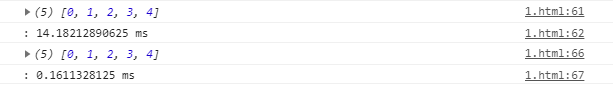
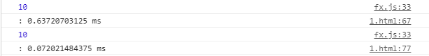

### take

- iterable을 순회하면서 `배열의 길이 === limit` 일 때 결과를 반환하는 함수

```javascript
const take = (l, iter) => {
    let res =[];
    for (const a of iter) {
        res.push(a);
        if (res.length === l) return res;
    }
}
```

### 어떻게 사용할 수 있을까?

- 이전에 만들었던 `L.range()`를 take함수와 조합해서 사용해보자.

```javascript
// range()
console.time('')
log(take(5, range(1000000)));
console.timeEnd('')

// L.range()
console.time('')
log(take(5, L.range(1000000)));
console.timeEnd('')
```

- range의 경우 배열에는 이미 1000000개의 숫자가 담겨있는 상태이며, 그 중에서 5개만 뽑음
- L.range의 경우 배열에는 아무것도 담기지 않은 상태에서 take함수를 실행



굉장한 시간 차이를 볼 수 있다..

```javascript
// currying
const take = curry((l, iter) => {
    let res = [];
    let i = -1;
    for (const a of iter) {
        res.push(a);
        if (res.length == l) return res;
    }
    return res;
});

// range()
console.time('')
go(
  range(10000),
  take(5),
  reduce(add),
  log);
console.timeEnd('')

// L.range()
console.time('')
go(
  L.range(10000),
  take(5),
  reduce(add),
  log);
console.timeEnd('')
```

역시 차이가 많이난다.




### 오늘의 정리

`range()`같은 경우 모든 배열을 다 평가해놓는다. (무한 배열을 사용할 수 없다.)

`L.range()`는 배열을 평가하지 않고, 배열에 함수를 통해 값을 뽑아낼 시점에서만 동작한다.

`L.range()`는 **L.range(Infinity)** 

​	즉, **[1, 2, 3, 4, 5, ...]** 처럼 몇개가 될지 모르는 함수에서도 사용할 수 있다.(range로 하면 터지겠지..?)

`L.range()`의 이러한 지연성은 **효율성**과 다른 함수와의 **조합성**을 높여줄 수 있다.

